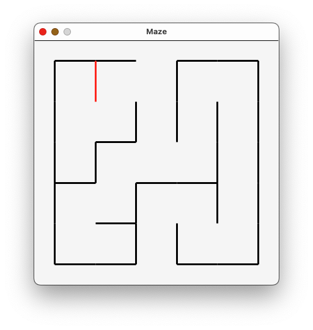

# Pair Project #1: Maze

This is a pair programming project.  Work with your assigned partner. Only one
of you has to turn it in, but make sure you don't both think the other one was
doing it.

# Overview

Write a program that draws a maze given to you in ASCII-art form.

For instance, your program, given the following input of a 5x5 maze in a file
named [`maze.txt`](./maze.txt):

```
##### #####
# #   #   #
# # # # # #
#   # # # #
# ### # # #
# #     # #
### ##### #
#   #   # #
# ### # # #
#   # #   #
##### #####
```

should draw precisely (except for the red coloring) this graphic:



The program should work on any plain text file, with changing the filename being
the only modification needed to the code.  You can test it on these two files:

* [`maze.txt`](./maze.txt)
* [`maze10x10.txt`](./maze10x10.txt)

## Hints

Do not rush to write this program.  Spend some time first discussing strategies
to solve this problem with your partner.  For example, you may want to ask
yourselves if *all* the characters in the input file are relevant, whether it
might help to process the input in a single loop nest, or whether it might help
to read the entire input all at once with the `readlines` function (note the
trailing `s`).

In the ASCII input, mazes will always be square, hallways are always one
character wide, and turns are always 90 degrees.

Your program should only import *one* library (`graphics`).  If not already
available on your system, type the following in a terminal or command window to
install it.

```
pip3 install graphics.py
```

Then, at the top of your file, import the library with

```
import graphics as g
```

Assuming you have a line like

```
win = g.GraphWin("Maze", 400, 400)
```

early in your program, you can save yourself a lot of math by adjusting the
scale of the graphic window with

```python
win.setCoords(-0.5, -0.5, size + 0.5, size + 0.5)
```

where `size` is the size of the maze.  In the example above, `size` is 5.  Then,
you can draw the red line seen in the figure above with

```python
l = g.Line(g.Point(1.0, 5.0), g.Point(1.0, 4.0))
l.setWidth(3)
l.draw(win)
```

Be mindful of the difference in the coordinate systems when contrasting a
two-dimensional array and the graphical canvas.

* With the canvas, the origin is in the bottom left corner of the screen.
* With an array, the “origin” is in the top left corner.

## What to hand in

Hand in your one file `maze.py`.

Include the names of both participants in a comment at the top of your code (if
one person didn't contribute, don't include their name).
