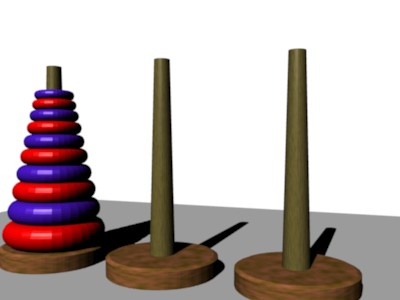

# CS2 Spring 2025 Note 19

## Puzzle

The Tower of Hanoi puzzle consists of three rods (let us label them rods A, B,
and C) and a number of disks of distinct diameters, which can slide onto any
rod.  The puzzle begins with the disks stacked on rod A in order of decreasing
size, the smallest at the top, thus approximating a conical shape.  The
objective of the puzzle is to move the entire stack from rod A to rod C,
obeying the following rules:

1. Only one disk may be moved at a time.
2. Each move consists of taking the upper disk from one of the stacks and
   placing it on top of another stack or on an empty rod.
3. No disk may be placed on top of a disk that is smaller than it.

Write a program that gives a user the instructions to move a stack of `n` disks
from rod A to rod C.

(Text adapted from the corresponding Wikipedia
[article](https://en.wikipedia.org/wiki/Tower_of_Hanoi), Wikipedia:CC BYSA.)

GeniXPro at the English Wikipedia, CC BY-SA 3.0
<http://creativecommons.org/licenses/by-sa/3.0/>, via Wikimedia Commons
