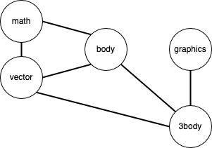

# CS2 Spring 2025 Note 32

## Graph

In discrete mathematics, a graph is an abstraction showing relationships between
pairs of objects.  Objects are represented by *vertices* (also called *nodes*)
and relationships between vertices are represented by *edges*.

Below is an example graph illustrating the relationships among the various
modules used in `three_body.py` through the import statements.  In this
example, each module is represented by a vertex and an edge appears between two
vertices if the module represented by one of the vertices imports the module
represented by the other vertex.

## Depth-first search

Depth-first search (DFS) is an algorithm for *traversing* graphs.  In one
variation, this algorithm starts at some vertex and explores as far as possible
along edges before backtracking.  Usually, extra memory is needed to track the
state of the search (progress made in the search and which vertices have already
been visited).

## Activity

1. Draw a graph corresponding to the 5x5 maze example used in the pair
programming assignment p3.  For instance, represent every empty spaces, the
entrance, and the exit as vertices.  Connect two vertices with an edge if the
two associated empty spaces are adjacent.

2. Can a depth-first search help you find the exit from the entrance?

3. Is your solution to assignment p3 an example of depth-first search?
